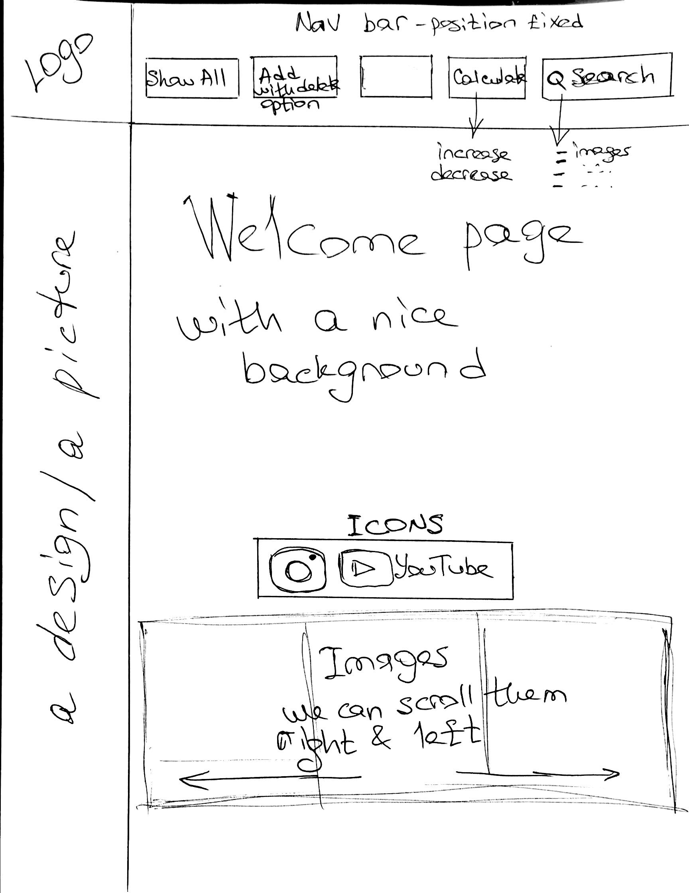

                        Project2 - React
## Link to the deployed site:

## About the application:
It's a browser and mobile version of the app of Harvard Museum and Gallery.

## Wireframe images
There is a wireframe image.

## Entrance page:
When you load the site you will see the Entrance page with amusing animation triangle,
which fits perfectly to the style of that black-and-white stylish page.

## Landing/Main page:
The site loads the ....
You can come back to this page by clicking Main page on the navigation bar.

## Choose a section on the Navigation Bar:
When you choose a section by clicking on it, the page will appear with ....

## Images page:
You can see images such as Books, Coins, Furniture, etc., rendered from API by "images".

## Videos page:
- videos 36 items by "primaryurl", "description", "copyright"

## Gallery page:
- gallery 64 items by 'name' and 'theme'

## Classification page:
 - classification 58 items by "name" - such as Books, Coins, Furniture, etc.

## Addresses page:
 - site 3 items by "address", "name", "geo"

API of Harvard museum has more than 260000 items and we used part of them in this application.
