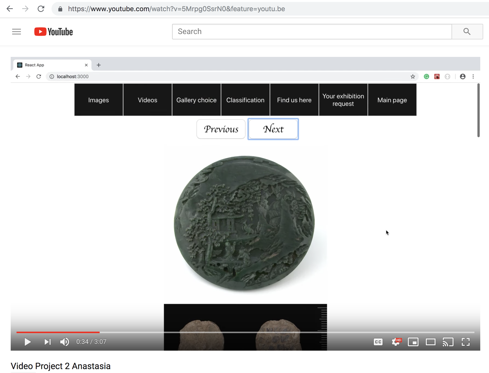

                Project2 - ReactJS using the API
API of Harvard museum has more than 260000 items and we used part of them in this application.

## Link to the Youtube video:
https://youtu.be/5Mrpg0SsrN0
https://www.youtube.com/watch?v=5Mrpg0SsrN0&feature=youtu.be

## About the application:
It's a browser and mobile version of the app of Harvard Museum and Gallery. It is written with ReactJS using API request.

## Wireframe images
There is a wireframe image.

## Entrance page:
When you load the site you will see the Entrance page with the background picture and the amusing animated button, that fits perfectly to the style of that black-and-white stylish page.

## Landing/Main page:
When we click on the button on the Entrance page the Landing page shows up. It has nice animated text. You can come back to this page by clicking Main page button on the navigation bar.

## Choose a section on the Navigation Bar:
On the top of any page except Entrance page, we can see the Navigation Bar. When you choose a section by clicking on it, a certain page will appear.

## Images page:
You can see images such as Books, Coins, Furniture, etc., rendered from API by "images". They all have animated effect on hover.

## Videos page:
You can see 36 videos by "primaryurl", "description", "copyright" from the API.

## Gallery page:
There are 64 items by 'name', 'theme' and 'description'. Also, there is dropdown menu with the options.

## Classification page:
There is a variety of classification names.

## Addresses page:
There are 3 items by "address", "name", "geo" you can find there and the pictures have hover effect as well. Check it Out!
